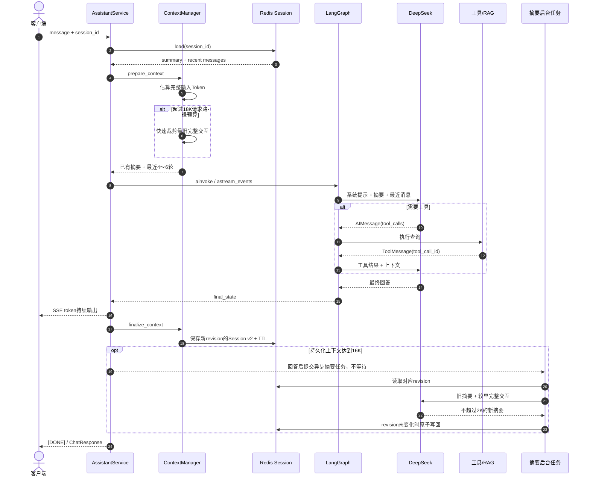

# AiAssistant 智能客服助手

> 基于 **DeepSeek + LangChain + LangGraph** 的拼团营销平台智能客服，采用 DDD 分层架构（参考 Java 项目 `group-buy-market`）。
>
> 通过自然语言回答用户在拼团进度、成团状态、余额使用、活动规则等方面的问题；具备工具调用、多轮对话、流式输出能力（分阶段实现）。

---

## 当前状态

| 阶段 | 内容 | 状态 |
| --- | --- | --- |
| 阶段 0 | 项目骨架 + DDD 分层 + 配置 + 通用层 + 接口契约 | ✅ 已完成 |
| 阶段 1 | DeepSeek LLM 接入（domain + infrastructure） | ✅ 已完成 |
| 阶段 2 | LangGraph 工作流 + Redis 多轮会话 | ✅ 已完成 |
| 阶段 3 | MCP 工具（拼团/成团/余额查询） | ✅ 已完成 |
| 阶段 4 | SSE 流式 HTTP 接口 | ✅ 已完成 |
| 阶段 5 | RAG 检索增强 | ✅ 已完成 |
| 阶段 5.5 | 上下文预算 + Redis v2 + 滚动摘要 | ✅ 已实现 |
| 阶段 6 | 部署文档（docker-compose + logging_config） | ⬜ 待实现 |
>
> 📌 **阶段 3 状态**：工具调用链路已通（LLM 自主调工具 -> tool_node 执行 -> 综合），T-1/T-2 直查 group_buy_market MySQL（group_buy_order 表，真实数据）；T-3 额度直查 ai-agent-scaffold-draw-io 的 Redis+MySQL 双写（user_quota/user_quota_usage）；MCP Server 对外暴露（3.5）未做。
>
> 📌 **阶段 5 状态**：RAG 检索增强已实现（`knowledge_search` 工具 + Qdrant + 百炼 `text-embedding-v4` / `qwen3-vl-rerank` + `/upload` 文本入库 + `/upload/file` PDF OCR 入库）；**切块**：段落+句子边界+页面元信息（`[PAGE N]` 标记 / `page_no`）+ 清洗页眉页脚。
>
> 📌 **阶段 5.5 状态**：已实现 Token 预算（24K 硬/16K 异步触发/2K 摘要上限/8K 最近/4-6 轮/6K 预留/15% 安全比例）+ 滚动摘要（完整交互为单位）+ Redis Session v2（同 key 版本化、v1 向后兼容、无损工具链）+ ITokenCounter 端口 + save_if_revision 乐观锁 + 同 session 去重 + 损坏降级。
>
> 📌 **阶段 6 状态**：部署收尾（`docker-compose` + `logging_config`）待实现。
>
> 📌 **上下文管理**：Token 预算 + 滚动摘要 + Redis Session v2。多档预算（硬预算 24K / 异步触发 16K / 摘要上限 2K / 最近消息 8K / 最小 4 轮·最大 6 轮 / 动态预留 6K / 安全比例 15%）；超预算按「完整交互」滚动摘要最老轮次；回答完成后异步预压缩（`compact_trigger`）；同 key 版本化、v1 向后兼容、无损保留工具调用链（`tool_calls`/`tool_call_id`）；元数据 `revision`/`updated_at`/`source_message_count`。

> ⚠️ **当前能力边界**：阶段 0-4 已完成（服务层 + HTTP）——能通过 `AssistantService` 完成**多轮** LLM 对话（Redis 记上下文，按 `session_id` 隔离），**已提供 HTTP 接口**（`/chat` SSE 流式、`/chat/sync` 非流式、`/health`）。可 `uvicorn app.main:app` 启动 Web 服务（`/docs` 看 Swagger），或直接跑 `tests/` 验证。

---

## 技术栈

| 维度 | 选型 |
| --- | --- |
| 语言 | Python ≥ 3.12 |
| LLM | DeepSeek `deepseek-chat`（OpenAI 兼容接口） |
| LLM 编排 | LangChain / LangChain-OpenAI |
| 工作流 | LangGraph（阶段 2 起） |
| Web 框架 | FastAPI + Uvicorn |
| 会话存储 | Redis（阶段 2 起） |
| 业务数据 | MySQL 直查 group_buy_market（阶段 3 起） |
| 向量库 | Qdrant（RAG，阶段 5 起） |
| Embedding/Rerank | 阿里云百炼 qwen3-vl-embedding / text-embedding-v4 / qwen3-vl-rerank（阶段 5 起） |
| 配置 | Pydantic Settings + `.env` |
| 架构 | DDD 分层（app / api / trigger / domain / infrastructure / common） |

---

## 目录结构

```
AiAssistant/
├── app/                            # 应用启动层
│   ├── main.py                     # ✅ FastAPI 入口 + TraceId 中间件（阶段 4）
│   ├── config/settings.py          # ✅ Pydantic Settings（读 .env）
│   └── dependency.py               # ✅ 依赖注入装配（LLM 端口 + 仓储 + Graph + 服务）
├── api/                            # 接口契约层
│   ├── response.py                 # ✅ 统一 Response<T>
│   └── dto/chat.py                 # ✅ ChatRequest / ChatResponse / ChatMessageDTO
├── common/                         # 通用类型层（对应 Java types 模块）
│   ├── enums.py                    # ✅ ResponseCode
│   ├── exception.py                # ✅ AppException
│   ├── trace.py                    # ✅ TraceId 上下文（ContextVar）
│   └── event.py                    # ⬜ 事件层预留
├── domain/                         # 领域层
│   ├── assistant/
│       ├── adapter/
│       │   ├── port/illm_port.py                 # ✅ LLM 端口接口
│       │   ├── port/isummarizer_port.py          # ✅ 摘要器端口（上下文管理）
│       │   ├── port/itoken_counter.py            # ✅ Token 计数端口（上下文管理）
│       │   └── repository/isession_repository.py # ✅ 会话仓储接口（v2，上下文管理）
│       ├── model/valobj/session_context.py       # ✅ SessionContext（摘要+完整消息）
│       └── service/
│           ├── assistant_service.py              # ✅ IAssistantService 接口
│           ├── context_budget_service.py         # ✅ 上下文预算+滚动摘要
│           ├── assistant_service_impl.py         # ✅ 多轮实现：load→graph→save（阶段 2）
│           └── graph/                            # ✅ LangGraph 工作流（阶段 2）
│               ├── state.py                      #   AssistantState
│               ├── assistant_graph.py            #   组装 intent/tool/response
│               └── nodes/{intent,tool,response}_node.py
│   └── mcp/                                      # ✅ MCP 工具领域（阶段 3）
│       ├── model/entity/groupbuy.py              #   值对象（拼团进度/成团/额度）
│       ├── adapter/repository/
│       │   ├── igroupbuy_repository.py           #   拼团仓储接口
│       │   └── iuser_quota_repository.py         #   用户额度仓储接口
│       └── service/tools/                        #   3 个 @tool：拼团/成团/余额
│   └── rag/                                      # ✅ RAG 领域（阶段 5）
│       ├── model/entity/document.py              #   DocumentChunk 值对象
│       ├── adapter/
│       │   ├── port/{iembedding,irerank}_port.py #   嵌入/重排序端口
│       │   └── repository/ivector_repository.py  #   向量仓储端口
│       ├── service/retrieval_service.py          #   IRetrievalService 接口
│       └── service/tools/knowledge_search_tool.py#   knowledge_search @tool
├── infrastructure/                 # 基础设施层
│   ├── llm/deepseek_chat.py                      # ✅ ChatOpenAI(DeepSeek) 封装
│   ├── adapter/
│   │   ├── port/deepseek_llm_adapter.py          # ✅ ILLMPort 实现（chat / chat_stream）
│   │   ├── port/llm_summarizer.py                # ✅ LLM 摘要器（滚动摘要）
│   │   ├── port/token_counter_impl.py            # ✅ Token 计数器（含安全比例）
│   │   └── repository/
│   │       ├── redis_session_repository.py       # ✅ 会话仓储 Redis 实现（阶段 2）
│   │       ├── groupbuy_repository_impl.py       # ✅ 拼团仓储（直查 MySQL，阶段 3）
│   │       └── user_quota_repository_impl.py     # ✅ 用户额度仓储（Redis+MySQL 双读，阶段 3）
│   ├── mysql/mysql_client.py                     # ✅ MySQL 异步客户端（阶段 3）
│   ├── redis/redis_client.py                     # ✅ async Redis 客户端，按 loop 缓存（阶段 2）
│   └── rag/                                      # ✅ RAG 基础设施（阶段 5）
│       ├── embedding_service.py                  #   百炼 text-embedding-v4 嵌入
│       ├── rerank_service.py                     #   百炼 qwen3-vl-rerank 排序
│       ├── qdrant_repository.py                  #   Qdrant 向量仓储（query_points）
│       ├── text_chunker.py                       #   段落+句子+页面切块 / 清洗
│       ├── pdf_extractor.py                      #   PDF 按页 OCR（pypdfium2 + qwen-vl-ocr）
│       └── retrieval_service_impl.py             #   检索服务实现
├── trigger/http/                   # ✅ HTTP 触发器（阶段 4）
│   ├── chat_controller.py          #   POST /chat SSE 流式
│   ├── assistant_controller.py     #   POST /chat/sync 非流式
│   ├── upload_controller.py        #   POST /upload + /upload/file（PDF OCR）（阶段 5）
│   └── health_controller.py        #   GET /health
├── tests/test_llm.py               # ✅ 阶段 1 验证
├── tests/test_session.py           # ✅ 阶段 2 多轮验证
├── tests/test_tools.py             # ✅ 阶段 3 工具调用验证
├── tests/test_groupbuy_mapping.py  # ✅ 阶段 3 字段映射验证（mock）
├── tests/test_quota_mapping.py     # ✅ 阶段 3 额度映射验证（mock）
├── tests/test_sse.py               # ✅ 阶段 4 SSE 流式验证
├── tests/test_rag.py               # ✅ 阶段 5 RAG 检索验证
├── tests/test_pdf.py               # ✅ 阶段 5 PDF OCR 验证
├── tests/test_chunker.py           # ✅ 阶段 5 切块/清洗验证（纯文本）
├── tests/test_context.py           # ✅ 上下文管理验证（预算+滚动摘要+Redis v2）
├── conftest.py                     # ✅ pytest 根级 sys.path 配置
├── requirements.txt
├── pyproject.toml
└── .env.example                    # 环境变量模板（见下；注意被 .gitignore 忽略）
```

---

## 上下文预算与滚动压缩（阶段 5.5，已实现）

### 设计目标

当前实现按 `session_id` 在 Redis 中保存最近 20 轮 `role/content` 消息。阶段 5.5 将其升级为基于 Token 预算的分层上下文：

```text
System Prompt（不持久化）
+ 较早对话的滚动摘要
+ 最近 4～6 轮完整原始交互
+ 当前用户问题
+ 本轮工具/RAG结果
→ 控制在 24K 输入预算内
```

主要规则：

- 持久化上下文达到 16K Token 时，在回答结束后触发异步压缩；
- 摘要最多约 2K Token，最近原始消息最多约 8K Token，并为工具/RAG预留约 6K；
- 正常情况下最近至少保留 4 轮，在预算允许时最多保留 6 轮；若必要字段裁剪后仍超过 24K，则硬预算优先，只保留当前问题和尽可能多的最近完整交互；
- 当前轮永远保留，`SESSION_MAX_TURNS=20` 只作为异常保护；
- 工具调用按完整链路保留，不能拆开 `AIMessage(tool_calls)` 与对应 `ToolMessage(tool_call_id)`；
- 请求快速路径不调用摘要 LLM；后台摘要和 Token 计数失败时降级保留最近完整交互，不阻断客服主请求；
- 本期不实现跨会话长期记忆。

预算来源：

```text
(3K固定内容 + 8K最近历史 + 2K摘要 + 6K工具/RAG增长) ÷ (1 - 15%)
≈ 22.4K → 向上取整为24K

16K异步触发线 = 24K硬预算 - 6K动态预留 - 2K额外缓冲
```

### 运行流程



### Redis Session v2

Key 保持不变：

```text
aiassistant:session:{session_id}
```

Value 从旧版消息数组升级为：

```json
{
  "schema_version": 2,
  "revision": 12,
  "summary": {
    "content": "用户正在查询团队T1001，此前结果显示还差2人成团。",
    "source_message_count": 8,
    "updated_at": "2026-07-12T14:30:00+08:00"
  },
  "messages": [
    {"type": "human", "data": {"content": "这个团什么时候结束？"}},
    {
      "type": "ai",
      "data": {
        "content": "",
        "tool_calls": [
          {
            "name": "group_buy_progress",
            "args": {"user_id": "u_123", "team_id": "T1001"},
            "id": "call_001"
          }
        ]
      }
    },
    {
      "type": "tool",
      "data": {
        "content": "{\"remain_people\":2}",
        "tool_call_id": "call_001"
      }
    },
    {
      "type": "ai",
      "data": {
        "content": "当前还差2人即可成团。",
        "tool_calls": []
      }
    }
  ],
  "updated_at": "2026-07-12T14:30:03+08:00"
}
```

`messages` 将使用 LangChain 标准序列化，不再手写 `role/content` 映射。旧版 JSON 数组仍可读取，并在下一次保存时自动升级到 v2。`revision` 用于避免后台摘要覆盖新消息。System Prompt、API Key、RAG 原始文档和跨会话用户记忆不会写入此 Key。

完整需求、异常策略和验收条件见 `PRD.md` 第九章；分步骤实施清单见 `IMPLEMENTATION.md` 阶段 5.5。

---

## 快速开始

### 1. 环境准备

```bash
# 要求 Python >= 3.12
python -m venv .venv

# 激活虚拟环境
# Windows (Git Bash):
source .venv/Scripts/activate
# Windows (PowerShell):
.venv\Scripts\Activate.ps1
# macOS / Linux:
source .venv/bin/activate

# 安装依赖
pip install -r requirements.txt
```

### 2. 配置 `.env`

在项目根目录创建 `.env`（**该文件含密钥，已被 `.gitignore` 忽略，不会入库**），填入：

```ini
# ===================== DeepSeek =====================
DEEPSEEK_API_KEY=sk-你的真实key
DEEPSEEK_BASE_URL=https://api.deepseek.com
DEEPSEEK_MODEL=deepseek-chat

# ===================== Redis（多轮会话存储，阶段 2 起）=====================
REDIS_HOST=127.0.0.1
REDIS_PORT=6379
REDIS_PASSWORD=
REDIS_DB=0

# ===================== 业务数据网关（group-buy-market）=====================
GROUPBUY_API_BASE=http://localhost:8091

# ===================== MySQL（直查 group_buy_market 库）=====================
MYSQL_HOST=127.0.0.1
MYSQL_PORT=3306
MYSQL_USER=root
MYSQL_PASSWORD=
MYSQL_DATABASE=group_buy_market

# ===================== 应用 =====================
APP_HOST=0.0.0.0
APP_PORT=8088
APP_DEBUG=true

# ===================== 会话 =====================
SESSION_MAX_TURNS=20
SESSION_TTL_SECONDS=86400

# ===================== 上下文压缩（阶段 5.5，待实现）=====================
CONTEXT_INPUT_TOKEN_BUDGET=24576
CONTEXT_COMPACT_TRIGGER_TOKENS=16384
CONTEXT_SUMMARY_MAX_TOKENS=2048
CONTEXT_RECENT_MAX_TOKENS=8192
CONTEXT_MIN_RECENT_TURNS=4
CONTEXT_MAX_RECENT_TURNS=6
CONTEXT_DYNAMIC_RESERVE_TOKENS=6144
CONTEXT_TOKEN_SAFETY_RATIO=0.15

# ===================== RAG（向量存储 Qdrant + 百炼模型，阶段 5）=====================
RAG_ENABLED=false
QDRANT_URL=http://localhost:6333
QDRANT_API_KEY=
QDRANT_COLLECTION=ai_assistant
DASHSCOPE_API_KEY=
DASHSCOPE_BASE_URL=https://dashscope.aliyuncs.com/compatible-mode/v1
EMBEDDING_MODEL=qwen3-vl-embedding
EMBEDDING_MODEL_SYNC=text-embedding-v4
EMBEDDING_MODEL_ASYNC=text-embedding-async-v2
RERANK_MODEL=qwen3-vl-rerank
```

### 3. 运行阶段 1 验证

```bash
.venv/Scripts/python.exe tests/test_llm.py
```

预期输出：DeepSeek 返回中文客服回复，末尾打印 `阶段 1 验证通过 ✓`。

该脚本也可用 pytest 运行（安装 `pytest` 后）：

```bash
.venv/Scripts/python.exe -m pytest tests/test_llm.py -s
```

---

## 架构与依赖方向

```
trigger ──▶ api
   │
   ▼
domain ◀── infrastructure（实现 domain 的 port/repository 接口）
   │
   ▼
common（被所有层依赖）
```

- `domain` 不依赖 `infrastructure`，只定义 `port` 接口；
- `infrastructure` 实现 `domain` 接口；
- `app/dependency.py` 负责把 `infrastructure` 实现注入 `domain`；
- 严格遵守「依赖倒置」，便于替换 DeepSeek → 其他 LLM、Redis → 其他存储。

### 阶段 1 数据流

```
调用方
  └─ app.dependency.get_assistant_service()        # 装配
       └─ AssistantServiceImpl                       # domain：单轮服务
            └─ ILLMPort.chat(messages)               # domain：端口（接口）
                 └─ DeepSeekLLMAdapter                # infrastructure：实现
                      └─ ChatOpenAI.ainvoke           # infrastructure：LangChain 封装
                           └─ DeepSeek HTTP API
```

---

## 阶段 1 实现要点

| 文件 | 作用 |
| --- | --- |
| `domain/assistant/adapter/port/illm_port.py` | `ILLMPort` 抽象端口：`chat()` 非流式 + `chat_stream()` 流式 |
| `infrastructure/llm/deepseek_chat.py` | 用 `ChatOpenAI(model=deepseek-chat, base_url, api_key)` 封装 DeepSeek |
| `infrastructure/adapter/port/deepseek_llm_adapter.py` | `ILLMPort` 实现，内部持有 `ChatOpenAI`，异常归一为 `AppException` |
| `domain/assistant/service/assistant_service.py` | `IAssistantService` 接口 |
| `domain/assistant/service/assistant_service_impl.py` | `AssistantServiceImpl`：组装消息 → 调端口 → 返回 `ChatResponse` |
| `app/config/settings.py` | Pydantic Settings 自动读取 `.env` |
| `app/dependency.py` | 工厂函数 + `lru_cache` 单例装配 |
| `common/` | `ResponseCode` / `AppException` / `TraceId`（对齐 Java `types` 模块） |
| `api/` | `Response[T]` 与对话 DTO |

---

## 命名说明：`types/` → `common/`

PRD 中 DDD 的「通用类型层」写作顶层 `types/` 包，但 Python 标准库已占用 `types` 模块名（解释器启动即缓存，且 `enum` 依赖它），导致 `from types.enums import ...` 报 `'types' is not a package`。因此将该层重命名为 `common/`，子模块结构与 PRD 一致，其余分层包名不变。详见 `common/__init__.py` 顶部说明。

---

## 路线图

- **阶段 2**：LangGraph State + 意图/工具/回答三节点 + Redis 会话仓储（多轮上下文）
- **阶段 3**：MCP 工具（拼团进度 / 成团进度 / 余额使用）+ MySQL 直查
- **阶段 4**：FastAPI SSE 流式 `/chat` 接口 + 异常降级
- **阶段 5**：RAG 检索增强（Qdrant + 百炼 embedding/rerank + PDF OCR）✅ 已完成
- **阶段 5.5**：Token 预算 + Redis Session v2 + 滚动摘要（设计完成，待实现）
- **阶段 6**：部署收尾（docker-compose + logging_config + 联调文档）

---

## 相关文档

- `PRD.md`：产品需求文档（本地，未入库）
- `IMPLEMENTATION.md`：分阶段实现步骤（本地，未入库）
